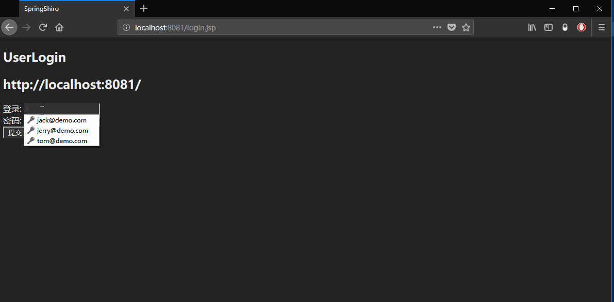
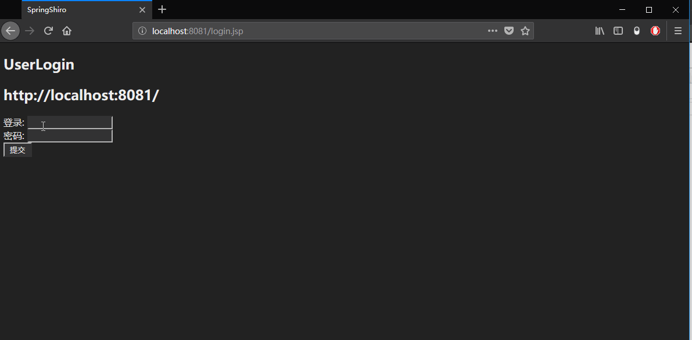
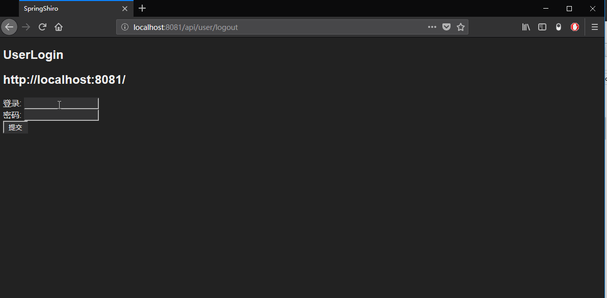

## SpringMVC Shiro 入门  

项目简介: 项目采用 SpringMVC、Shiro、Redis、Mybatis、MySQL 等技术架构，搭建最基本的权限认证与管理系统  

项目搭建操作步骤: [Spring-Shiro权限管理系统搭建教程](doc/Spring-Shiro权限管理系统搭建教程.md)  

## 1 权限架构描述

- 一个**用户**可以拥有多个**角色**  
- 一个**角色**拥有多项**权限**  

## 2 shiro 权限管理项目演示

- 1) `jack` 用户,非 `admin` 角色,也没有 `api/user/updateUserInfo` 权限  

- 2) `jerry` 用户, 非 `admin` 角色,拥有 `api/user/updateUserInfo` 权限  

- 3） `tom` 用户, 拥有 `admin` 角色,同时拥有 `api/user/updateUserInfo` 权限  

