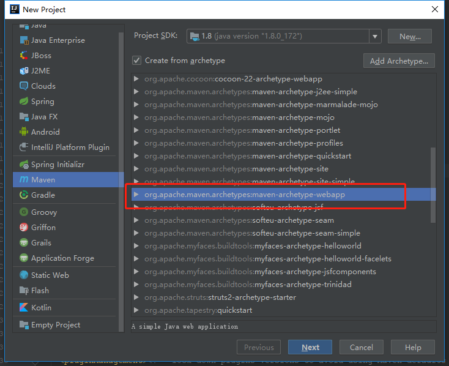
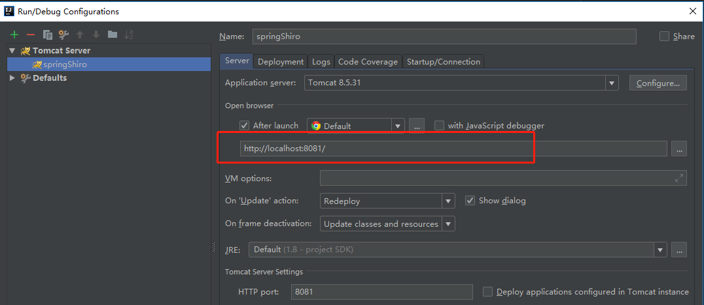

## Spring-Shiro权限管理系统搭建教程  


### 1 创建 项目  

项目类型选择 `Maven webapp `  类型  

<div align=center> 

 

</div> 

### 2 配置 `pom.xml` 文件  

在 `pom.xml` 文件中引入 Spring,Shiro,Mybatis,MySQL,Redis 等依赖  

pom 文件: [pom.xml](../pom.xml)  

### 3 创建 `package`,`class`  

创建 `package` 的顺序: `entity` --- `dao`  --- `common`(接口结果返回封装等) ---  `service` 及其 `impl` --- `controller`  ---   

### 4 Spring 配置文件  

先配置 Spring 的配置文件，将项目构建为一个基本的 SpringMVC 项目,后边在进行其他的整合操作  

`web.xml` 文件: [src/main/webapp/WEB-INF/web.xml](../src/main/webapp/WEB-INF/web.xml)  

`Spring* .xml` 文件:  

[src/main/resources/spring/spring-dao.xml](../src/main/resources/spring/spring-dao.xml)  

[src/main/resources/spring/spring-service.xml](../src/main/resources/spring/spring-service.xml)  

[src/main/resources/spring/spring-web.xml](../src/main/resources/spring/spring-web.xml)  

[src/main/resources/spring/spring-redis.xml](../src/main/resources/spring/spring-redis.xml)

数据库配置 `jdbc.properties` : [src/main/resources/jdbc.properties](../src/main/resources/jdbc.properties)  

Redis 配置 `redis.properties` : [src/main/resources/redis.properties](../src/main/resources/redis.properties)  

日志配置 `logback.xml` : [src/main/resources/logback.xml](../src/main/resources/logback.xml)  

### 5 数据库创建  

数据库创建: [springShiro-database-create.sql](springShiro-database-create.sql)  

测试数据: [springShiro-demo.sql](springShiro-demo.sql)  

### 6 mapper 文件  

mapper 文件路径: `src/main/resources/mapper/*.xml`  

用户模块 mapper 文件: [src/main/resources/mapper/usermapper.xml](../src/main/resources/mapper/usermapper.xml)  

### 7 整合 Shiro 框架    

#### 7.1 配置文件

`web.xml` 中添加 Shiro 的拦截器(`shiroFilter`) : [srcmain/webapp/WEB-INF/web.xml](../srcmain/webapp/WEB-INF/web.xml)  

新增 `spring-shiro.xml` 配置文件: [src/main/resources/spring/spring-shiro.xml](../src/main/resources/spring/spring-shiro.xml)  

修改 `spring-web.xml` 配置文件,开启 `Shiro` 相关注解: [src/main/resources/spring/spring-web.xml](../src/main/resources/spring/spring-web.xml)  

#### 7.2 重要 java 类  

自定义 `Realm` 实现类: [com.ljq.demo.shiro.security.DefaultRealm](../src/main/java/com/ljq/demo/shiro/security/DefaultRealm.java)  

自定义拦截器 `Filter`: [com.ljq.demo.shiro.filter.DefaultFormAuthenticactionFilter](../src/main/java/com/ljq/demo/shiro/filter/DefaultFormAuthenticactionFilter.java)  

#### 7.3 注意事项  

按照本项目中 `Shiro` 的权限配置运行,则在**发布项目时不能够添加项目名称**  

**正确** 登录页面访问路径: [http://localhost:8081/login.jsp](http://localhost:8081/login.jsp)  

**错误** 登录页面访问路径: [http://localhost:8081/xxxDemo/login.jsp](http://localhost:8081/xxxDemo/login.jsp)  

服务器(Tomcat) 配置截图:  




#### 7.4 redis 接管 shiro session 缓存  

更改 shiro session 缓存,需要重写 sessionDAO 方法  

**当使用 Redis 接管 shiro session 缓存之后,关闭浏览器不会导致 session 失效,服务器重启也不会导致 session 失效,只有用户登出或 session 过期才会失效**  

具体参考: [com.ljq.demo.shiro.common.cache.RedisSessionDAO](../src/main/java/com/ljq/demo/shiro/common/cache/RedisSessionDAO.java)  

#### 7.5 关于 shiro 的权限配置说明    

```xml
<!-- shiro 过滤器,此处的 bean id 必须要和 web.xml 中的 shiro 过滤器保持一致 -->
    <bean id="shiroFilter" class="org.apache.shiro.spring.web.ShiroFilterFactoryBean">
       <!-- 此处省略其它配置 -->
       
        <!-- 权限分配 -->
        <property name="filterChainDefinitions">
            <value>
                /login.jsp* = anon
                /error/** = anon
                /api/user/checkRole* = roles[admin]
                /api/user/checkPermission* = perms["api/user/updateUserPermission"]
                /api/user/** =authc
                /** = authc
            </value>
        </property>
    </bean>
```

- `/login.jsp*` : 拦截项目根目录下的 `login.jsp` 请求链接,在 `login.jsp` 后边添加参数,也一并拦截  

eg:   [http://localhost:8081/login.jsp](http://localhost:8081/login.jsp)   和 [http://localhost:8081/login.jsp?username=xxxx](http://localhost:8081/login.jsp?username=xxxx)  

`/error/**` , `/api/*`  等属于同样的道理  

- anon : 表明无需权限即可访问  
- authc : 表明需要认证之后才可以访问, 需要重写 `Filter` 来自定义认证  
- roles[admin] : 表明只有属于 `admin` 角色的用户才可以访问,如果设置多个角色,所有角色名称在双引号( `""` )内,角色之间用逗号( `,` )分割,eg: `roles["admin,dev"]`   ，表明拥有 `admin` 或 `dev` 角色的用户可以访问  
- perms["api/user/updateUserPermission"]: 表明拥有 `api/user/updateUserPermission` 权限的用户可以访问, `[]` 内填写的时权限 URL ,可以为 `api/user/xxx`,也可以为 `user:xxx`  


